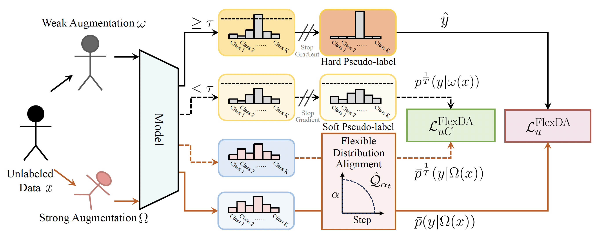

<div id="top"></div>
<!--
*** Thanks for checking out the Best-README-Template. If you have a suggestion
*** that would make this better, please fork the repo and create a pull request
*** or simply open an issue with the tag "enhancement".
*** Don't forget to give the project a star!
*** Thanks again! Now go create something AMAZING! :D
-->

<!-- PROJECT SHIELDS -->

<!--
*** I'm using markdown "reference style" links for readability.
*** Reference links are enclosed in brackets [ ] instead of parentheses ( ).
*** See the bottom of this document for the declaration of the reference variables
*** for contributors-url, forks-url, etc. This is an optional, concise syntax you may use.
*** https://www.markdownguide.org/basic-syntax/#reference-style-links
-->

<!-- 
***[![MIT License][license-shield]][license-url]
-->

# 🌎 [ECCV 2024] ADELLO-LTSSL
[](https://arxiv.org/abs/2306.04621) | 📝[Paper](https://arxiv.org/pdf/2306.04621) | 🔥[Poster](assets/adello_poster.pdf) | 💻[Slides](assets/adello_conference_slides.pdf) 

by **Emanuel Sanchez Aimar, Nathaniel Helgesen, Yonghao Xu, Marco Kuhlmann, Michael Felsberg**

This repository is the official Pytorch implementation of **Flexible Distribution Alignment: Towards Long-tailed Semi-supervised Learning with Proper Calibration** (ECCV 2024). 

## Notes

**[2025/03/12]** 🔥 If you demand peak performance at any cost, don't miss **BalPoE**, our CVPR 2023 approach for long-tailed recognition—extending logit adjustment to multiple experts, delivering unbiased predictions and setting new SOTA; see our [paper](https://arxiv.org/abs/2206.05260) and [GitHub repo](https://github.com/emasa/BalPoE-CalibratedLT).

## Overview

<p align="center">  </p>

## Abstract

Long-tailed semi-supervised learning (LTSSL) represents a practical scenario for semi-supervised applications, challenged by skewed labeled distributions that bias classifiers. This problem is often aggravated by discrepancies between labeled and unlabeled class distributions, leading to biased pseudo-labels, neglect of rare classes, and poorly calibrated probabilities. To address these issues, we introduce Flexible Distribution Alignment (FlexDA), a novel adaptive logit-adjusted loss framework designed to dynamically estimate and align predictions with the actual distribution of unlabeled data and achieve a balanced classifier by the end of training. FlexDA is further enhanced by a distillation-based consistency loss, promoting fair data usage across classes and effectively leveraging underconfident samples. This method, encapsulated in ADELLO (Align and Distill Everything All at Once), proves robust against label shift, significantly improves model calibration in LTSSL contexts, and surpasses previous state-of-of-art approaches across multiple benchmarks, including CIFAR100-LT, STL10-LT, and ImageNet127, addressing class imbalance challenges in semi-supervised learning.

<!-- GETTING STARTED -->

## Getting Started

This is an example of how to set up our code locally.
To get a local copy up, running follow these simple example steps.

### Prerequisites

ADELLO is built on pytorch, with torchvision.

To install the required packages, you can create a conda environment:

```sh
conda create --name adello-ltssl python=3.8
```

To activate the conda environment:

```sh
conda activate adello-ltssl
```

then use pip to install required packages:

```sh
pip install -r requirements.txt
```

### Prepare Datasets

The detailed instructions for downloading and processing are shown in [Dataset Download](./preprocess/). Please follow it to download datasets before running or developing algorithms.

<p align="right">(<a href="#top">back to top</a>)</p>


<!-- USAGE EXAMPLES -->

### Training

Here is an example to train FixMatch+ADELLO on CIFAR100-LT with N1=150 / M1=300 and imbalance ratios of 50 / 50  (labeled and unlabeled distributions match).
Training other supported algorithms (on other datasets with different label settings) can be specified by a config file:

```sh
export EXP_NAME=fixmatch_adello_cifar100_lb150_50_ulb300_50_0
export SEED=1
python train.py --c config/classic_cv_imb/fixmatch_adello/${EXP_NAME}_s${SEED}.yaml --seed $SEED --save_dir ./saved_models/classic_cv_imb --save_name ${EXP_NAME}_s${SEED} --load_path ./saved_models/classic_cv_imb/${EXP_NAME}_s${SEED}/latest_model.pth
```

Important: to reproduce our main results, train five runs with SEED = {1,2,3,4,5} and compute mean and standard deviation over reported results.

### Evaluation

After training, you can check the evaluation performance on training logs, or running the evaluation script:

```
python eval.py --dataset cifar100 --num_classes 100 --load_path /PATH/TO/CHECKPOINT
```

<!-- LICENSE -->

## License

Distributed under the MIT License. See `LICENSE.txt` for more information.

<p align="right">(<a href="#top">back to top</a>)</p>


## Citation
If you find our work inspiring or use our codebase in your research, please cite our work.
```
@InProceedings{SanchezAimar2024ADELLO_LTSSL,
    author="Sanchez Aimar, Emanuel
    and Helgesen, Nathaniel
    and Xu, Yonghao
    and Kuhlmann, Marco
    and Felsberg, Michael",
    title="Flexible Distribution Alignment: Towards Long-Tailed Semi-supervised Learning with Proper Calibration",
    booktitle="Computer Vision -- ECCV 2024",
    year="2025",
    editor="Leonardis, Ale{\v{s}}
    and Ricci, Elisa
    and Roth, Stefan
    and Russakovsky, Olga
    and Sattler, Torsten
    and Varol, G{\"u}l",
    publisher="Springer Nature Switzerland",
    address="Cham",
    pages="307--327",
    isbn="978-3-031-72949-2"
}
```

<!-- ACKNOWLEDGMENTS -->

## Acknowledgments

We thank the following projects:
- [USB](https://github.com/microsoft/Semi-supervised-learning) (original repo)
- [TorchSSL](https://github.com/TorchSSL/TorchSSL)
- [FixMatch](https://github.com/google-research/fixmatch)
- [CoMatch](https://github.com/salesforce/CoMatch)
- [SimMatch](https://github.com/KyleZheng1997/simmatch)
- [HuggingFace](https://huggingface.co/docs/transformers/index)
- [Pytorch Lighting](https://github.com/Lightning-AI/lightning)
- [README Template](https://github.com/othneildrew/Best-README-Template)

<p align="right">(<a href="#top">back to top</a>)</p>

<!-- MARKDOWN LINKS & IMAGES -->

<!-- https://www.markdownguide.org/basic-syntax/#reference-style-links -->
[contributors-shield]: https://img.shields.io/github/contributors/microsoft/Semi-supervised-learning.svg?style=for-the-badge
[contributors-url]: https://github.com/microsoft/Semi-supervised-learning/graphs/contributors
[forks-shield]: https://img.shields.io/github/forks/microsoft/Semi-supervised-learning.svg?style=for-the-badge
[forks-url]: https://github.com/microsoft/Semi-supervised-learning/network/members
[stars-shield]: https://img.shields.io/github/stars/microsoft/Semi-supervised-learning.svg?style=for-the-badge
[stars-url]: https://github.com/microsoft/Semi-supervised-learning/stargazers
[issues-shield]: https://img.shields.io/github/issues/microsoft/Semi-supervised-learning.svg?style=for-the-badge
[issues-url]: https://github.com/microsoft/Semi-supervised-learning/issues
[license-shield]: https://img.shields.io/github/license/microsoft/Semi-supervised-learning.svg?style=for-the-badge
[license-url]: https://github.com/microsoft/Semi-supervised-learning/blob/main/LICENSE.txt
